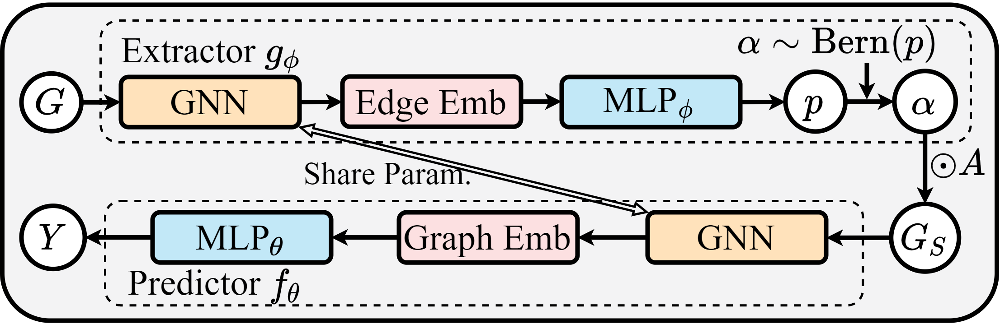
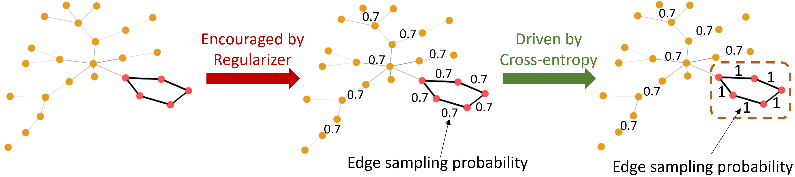

<h1 align="center">Graph Stochastic Attention (GSAT)</h1>
<p align="center">
    <a href="https://arxiv.org/abs/2201.12987"></a>
    <a href="https://github.com/Graph-COM/GSAT"></a>
    <a href="https://proceedings.mlr.press/v162/miao22a.html"> </a>
    <a href="https://colab.research.google.com/drive/1t0_4BxEJ0XncyYvn_VyEQhxwNMvtSUNx?usp=sharing"></a>
    <!-- <a href="https://github.com/Graph-COM/GSAT/blob/main/LICENSE"> </a>
    <a href="https://icml.cc/virtual/2022/spotlight/17430"> </a>
    <a href="https://icml.cc/media/icml-2022/Slides/17430.pdf"> </a>
    <a href="https://icml.cc/media/PosterPDFs/ICML%202022/a8acc28734d4fe90ea24353d901ae678.png"> </a> -->
</p>

**Blogs ([English](https://towardsdatascience.com/graph-machine-learning-icml-2022-252f39865c70#be75:~:text=and%20inductive%20settings.-,%E2%9E%A1%EF%B8%8F%20Miao%20et%20al,-take%20another%20perspective) - [中文](https://mp.weixin.qq.com/s/aP-XBqFLV0x8h9rtOKU_yg))** |
**[Slides](https://icml.cc/media/icml-2022/Slides/17430.pdf)** |
**[Poster](https://icml.cc/media/PosterPDFs/ICML%202022/a8acc28734d4fe90ea24353d901ae678.png)**

This repository contains the official implementation of GSAT as described in the paper: [Interpretable and Generalizable Graph Learning via Stochastic Attention Mechanism](https://arxiv.org/abs/2201.12987) (ICML 2022) by Siqi Miao, Mia Liu, and Pan Li.

## News
- Mar. 15, 2023: Check out GSAT on [GOOD](https://github.com/divelab/GOOD) benchamrk with leaderboard [here](https://good.readthedocs.io/en/latest/leaderboard.html). GSAT (again) achieves multiple SOTA results on out-of-distribution generalization on the recent benchmark, while being highly interpretable!
- Jan. 21, 2023: Check out our latest paper [Learnable Randomness Injection (LRI)](https://openreview.net/forum?id=6u7mf9s2A9) with code [here](https://github.com/Graph-COM/LRI), which is recently accepted to ICLR 2023! In LRI, we further generalize the idea of GSAT and propose four datasets with ground-truth interpretation labels from real-world scientific applications (instead of synthetic motif datasets to evaluate interpretability!).
- Nov. 16, 2022: A bug was reported in the code when averaging edge attention weigts for undirected graphs, as pointed out by this [issue](https://github.com/Graph-COM/GSAT/issues/5). We have fixed this bug in the latest version of the code by this [PR](https://github.com/Graph-COM/GSAT/pull/8).


## Introduction
Commonly used attention mechanisms have been shown to be unable to provide reliable interpretation for graph neural networks (GNNs). So, most previous works focus on developing post-hoc interpretation methods for GNNs.

This work shows that post-hoc methods suffer from several fundamental issues, such as underfitting the subgraph $G_S$ and overfitting the original input graph $G$. Thus, they are essentially good at checking feature sensitivity but can hardly provide trustworthy interpretation for GNNs if the goal is to extract effective patterns from the data (which should have been the most interesting goal).

This work addresses those issues by designing an inherently interpretable model. The key idea is to jointly train both the predictor and the explainer with a carefully designed **Graph Stochastic Attention (GSAT)** mechanism. With certain assumptions, GSAT can provide guaranteed  out-of-distribution generalizability and guaranteed inherent interpretability, which makes sure GSAT doesn't suffer from those issues. Fig. 1 shows the architecture of GSAT.

<p align="center"></p>
<p align="center"><em>Figure 1.</em> The architecture of GSAT.</p>

## Rationale of GSAT
The rationale of GSAT is to inject stochasticity when learning attention. For example, Fig 2 shows a task to detect if there exists a five-node-circle in the input graph, so edges with pink end nodes are the critical edges for this task. The main idea of GSAT is the following:
1. **<ins>A regularizer</ins>** is used to encourage high randomness, i.e. low sampling probability, say `0.7`.
    - In this case, every critical edge may be dropped `30%` of the time.
    - Whenever a critical edge is dropped, it may flip model predictions and incur a huge classification loss.
2. Driven by the **<ins>classification loss</ins>**, critical edges learn to be with low randomness, i.e. high sampling probability.
    - With high sampling probabilities (e.g. `1.0`), the critical edges are more likely to be kept during training.
3. The part with **<ins> less randomness</ins>** is the underlying critical data patterns captured by GSAT.

To implement the above mechanism, a proper regularizer is needed. As the goal is to control randomness, from an information-theoretic point of view it's to control the amount of information in $G$. So, the information bottleneck (IB) principle can be utilized, which helps to provide guaranteed OOD generalizability and interpretability, see `Theorem. 4.1.` in the paper.

<p align="center"></p>
<p align="center"><em>Figure 2.</em> The rationale of GSAT.</p>

## Installation
We have tested our code on `Python 3.9` with `PyTorch 1.10.0`, `PyG 2.0.3` and `CUDA 11.3`. Please follow the following steps to create a virtual environment and install the required packages.

Clone the repository:
```
git clone https://github.com/Graph-COM/GSAT.git
cd GSAT
```

Create a virtual environment:
```
conda create --name gsat python=3.9 -y
conda activate gsat
```

Install dependencies:
```
conda install -y pytorch==1.10.0 torchvision cudatoolkit=11.3 -c pytorch
pip install torch-scatter==2.0.9 torch-sparse==0.6.12 torch-cluster==1.5.9 torch-spline-conv==1.2.1 torch-geometric==2.0.3 -f https://data.pyg.org/whl/torch-1.10.0+cu113.html
pip install -r requirements.txt
```

In case a lower CUDA version is required, please use the following command to install dependencies:
```
conda install -y pytorch==1.9.0 torchvision==0.10.0 torchaudio==0.9.0 cudatoolkit=10.2 -c pytorch
pip install torch-scatter==2.0.9 torch-sparse==0.6.12 torch-cluster==1.5.9 torch-spline-conv==1.2.1 torch-geometric==2.0.3 -f https://data.pyg.org/whl/torch-1.9.0+cu102.html
pip install -r requirements.txt
```


## Run Examples
We provide examples with minimal code to run GSAT in `./example/example.ipynb`. We have tested the provided examples on `Ba-2Motifs (GIN)`, `Mutag (GIN)`  and `OGBG-Molhiv (PNA)`. Yet, to implement GSAT* one needs to load a pre-trained model first in the provided example. Also try     <a href="https://colab.research.google.com/drive/1t0_4BxEJ0XncyYvn_VyEQhxwNMvtSUNx?usp=sharing"></a> to play with `example.ipynb` in Colab.

It should be able to run on other datasets as well, but some hard-coded hyperparameters might need to be changed accordingly, see `./src/configs` for all hyperparameter settings. To directly reproduce results for other datasets, please follow the instructions in the following section.

## Reproduce Results
We provide the source code to reproduce the results in our paper. The results of GSAT can be reproduced by running `run_gsat.py`. To reproduce GSAT*, one needs to first change the configuration file accordingly (`from_scratch: false`).

To train GSAT or GSAT*:
```
cd ./src
python run_gsat.py --dataset [dataset_name] --backbone [model_name] --cuda [GPU_id]
```

`dataset_name` can be choosen from `ba_2motifs`, `mutag`, `mnist`, `Graph-SST2`, `spmotif_0.5`, `spmotif_0.7`, `spmotif_0.9`, `ogbg_molhiv`, `ogbg_moltox21`, `ogbg_molbace`, `ogbg_molbbbp`, `ogbg_molclintox`, `ogbg_molsider`.

`model_name` can be choosen from `GIN`, `PNA`.

`GPU_id` is the id of the GPU to use. To use CPU, please set it to `-1`.


### Training Logs
Standard output provides basic training logs, while more detailed logs and interpretation visualizations can be found on tensorboard:
```
tensorboard --logdir=./data/[dataset_name]/logs
```

### Hyperparameter Settings
All settings can be found in `./src/configs`.


## Instructions on Acquiring Datasets
- Ba_2Motifs
    - Raw data files can be downloaded automatically, provided by [PGExplainer](https://arxiv.org/abs/2011.04573) and [DIG](https://github.com/divelab/DIG).

- Spurious-Motif
    - Raw data files can be generated automatically, provide by [DIR](https://openreview.net/forum?id=hGXij5rfiHw).

- OGBG-Mol
    - Raw data files can be downloaded automatically, provided by [OGBG](https://ogb.stanford.edu/).

- Mutag
    - Raw data files need to be downloaded [here](https://github.com/flyingdoog/PGExplainer/tree/master/dataset), provided by [PGExplainer](https://arxiv.org/abs/2011.04573).
    - Unzip `Mutagenicity.zip` and `Mutagenicity.pkl.zip`.
    - Put the raw data files in `./data/mutag/raw`.

- Graph-SST2
    - Raw data files need to be downloaded [here](https://drive.google.com/drive/folders/1dt0aGMBvCEUYzaG00TYu1D03GPO7305z), provided by [DIG](https://github.com/divelab/DIG).
    - Unzip the downloaded `Graph-SST2.zip`.
    - Put the raw data files in `./data/Graph-SST2/raw`.

- MNIST-75sp
    - Raw data files need to be generated following the instruction [here](https://github.com/bknyaz/graph_attention_pool/blob/master/scripts/mnist_75sp.sh).
    - Put the generated files in `./data/mnist/raw`.

## FAQ
#### Does GSAT encourage sparsity?
No, GSAT doesn't encourage generating sparse subgraphs. We find `r = 0.7` (Eq.(9) in our paper) can generally work well for all datasets in our experiments, which means during training roughly `70%` of edges will be kept (kind of still large). This is because GSAT doesn't try to provide interpretability by finding a small/sparse subgraph of the original input graph, which is what previous works normally do and will hurt performance significantly for inhrently interpretable models (as shown in Fig. 7 in the paper). By contrast, GSAT provides interpretability by pushing the critical edges to have relatively lower stochasticity during training.

#### How to tune the hyperparameters of GSAT?
We recommend to tune `r` in `{0.5, 0.7}` and `info_loss_coef` in `{1.0, 0.1, 0.01}` based on validation classification performance. And `r = 0.7` and `info_loss_coef = 1.0` can be a good starting point.
Note that in practice we would decay the value of `r` gradually during training from `0.9` to the chosen value. Given our empirical observation, the classification performance of GSAT should always be no worse than that yielded by ERM (Empirical Risk Minimization) training, when its hyperparameters are tuned properly.

#### `p` or `α` to implement Eq. (9)?
Recall in Fig. 1, `p` is the probability of dropping an edge, while `α` is the sampled result from `Bern(p)`. In our provided implementation, as an empirical choice, `α` is used to implement Eq.(9) (the Gumbel-softmax trick makes `α` essentially continuous in practice). We find that when `α` is used it may provide more regularization and make the model more robust to hyperparameters. Nonetheless, using `p` can achieve the same performance.

#### How to sample $G_S$?
In practice, we don't yield $G_S$ by doing $\alpha \odot A$ in Fig. 1, because based on the gumbel-softmax trick it's non-trivial to make this operation differentiable for message-passing-based neural networks (MPNNs). Instead, the learned attention will act on the message of the corresponding edge. Once the message of an edge is dropped, one can (roughly) believe that the corresponding edge is dropped in MPNNs, and this is like an approximation of $\alpha \odot A$.

<!-- #### Can you show an example of how GSAT works?
Below we show an example from the `ba_2motifs` dataset, which is to distinguish five-node cycle motifs (left) and house motifs (right).
To make good predictions (minimize the cross-entropy loss), GSAT will push the attention weights of those critical edges to be relatively large (ideally close to `1`). Otherwise, those critical edges may be dropped too frequently and thus result in a large cross-entropy loss. Meanwhile, to minimize the regularization loss (the KL divergence term in Eq.(9) of the paper), GSAT will push the attention weights of other non-critical edges to be close to `r`, which is set to be `0.7` in the example. This mechanism of injecting stochasticity makes the learned attention weights from GSAT directly interpretable, since the more critical an edge is, the larger its attention weight will be (the less likely it can be dropped). Note that `ba_2motifs` satisfies our Thm. 4.1 with no noise, and GSAT achieves perfect interpretation performance on it.

<p align="center"></p>
<p align="center"><em>Figure 2.</em> An example of the learned attention weights.</p> -->


## Reference

If you find our paper and repo useful, please cite our paper:
```bibtex
@article{miao2022interpretable,
  title       = {Interpretable and Generalizable Graph Learning via Stochastic Attention Mechanism},
  author      = {Miao, Siqi and Liu, Mia and Li, Pan},
  journal     = {International Conference on Machine Learning},
  year        = {2022}
}
```
